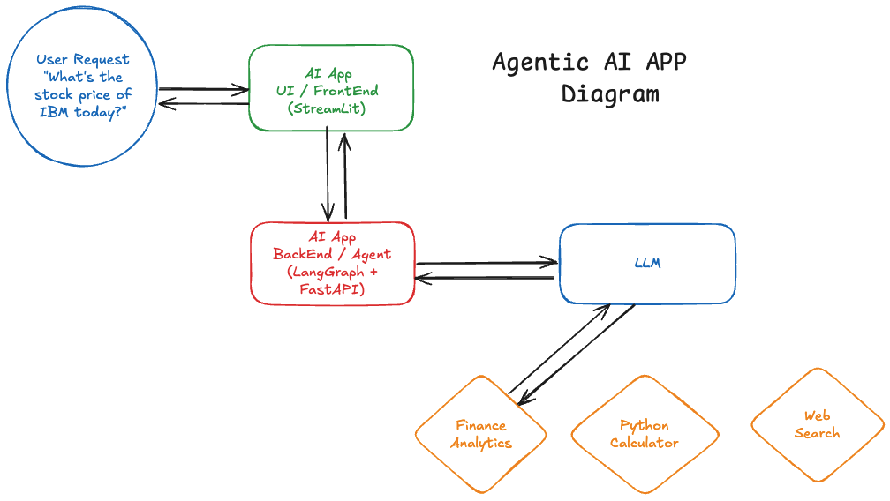
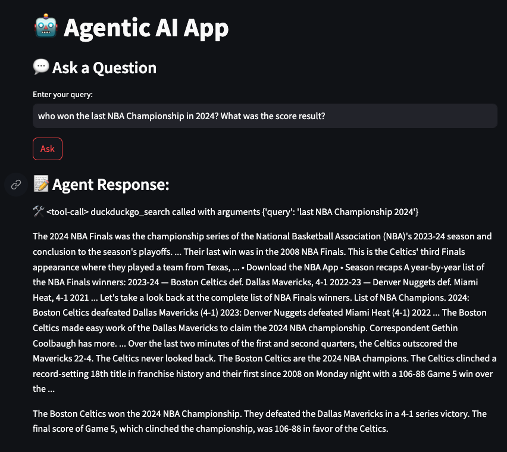
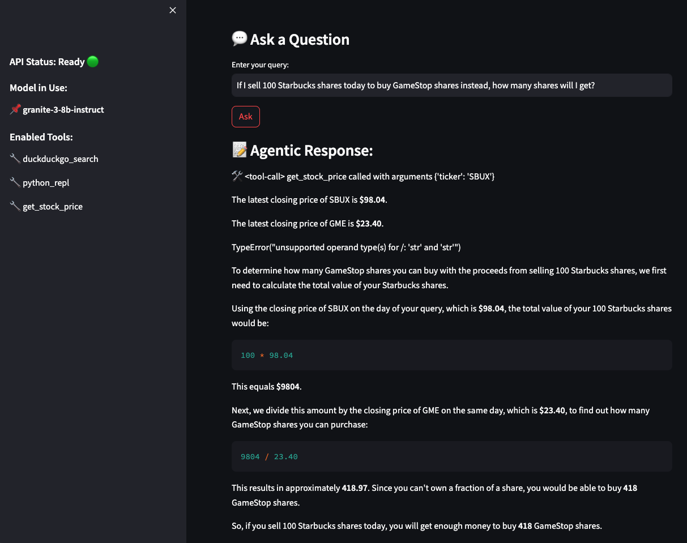
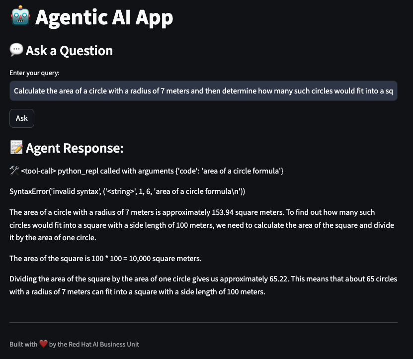
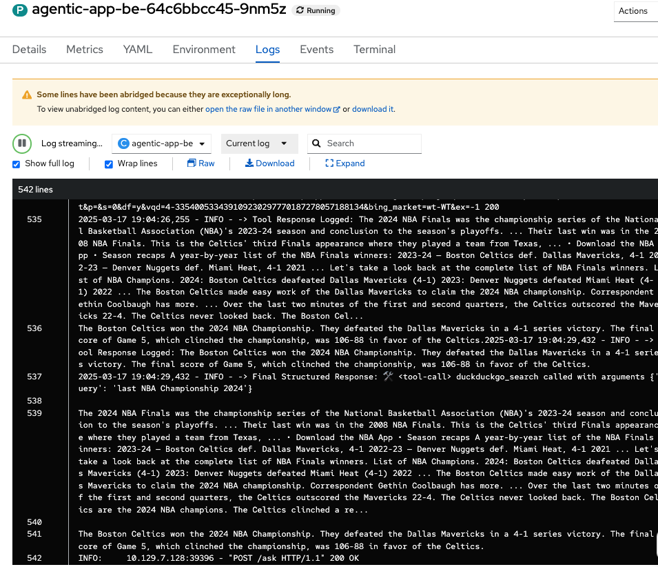

## Agentic APP - LangGraph

Welcome to the Agentic App example based on:

- **Backend:** LangGraph + FastAPI  
- **UI:** Streamlit  
- **Tools (via LangChain):**  
  - 📊 Finance Analyst Tool  
  - 🧮 Python Calculator  
  - 🌐 Web Browser  

## **🚀 How It Works**



1. **Users interact** via the **UI (Streamlit)**  
2. **Requests are processed** by an **Agentic LangGraph framework**  
3. **Backend agents** use **LangChain tools** to retrieve, compute, and analyze data  
4. **Results are displayed** seamlessly in the **UI**  

This architecture enables dynamic, multi-step decision-making Agentic AI **without hardcoded logic**.


### Deploy 

* Be ready to paste your LLM Endpoint, LLM Api Key and Model Name

> NOTE: Model As a Service (MaaS can be perfectly used to this use case).

* Use the deploy.sh script to deploy the demo in your namespace:

```bash
bash deploy-demo/deploy.sh
Enter API URL: https://my_url:443
Enter API Key: xxx
Enter Model Name: granite-3-8b-instruct
Enter Namespace (default: agentic-demo): agentic-demo-rcarrata
```

> NOTE: The API_URL will be required as is, not with /v1 at the end. The Namespace will be created if doesn't exist

### Usage

Just start asking questions and feel all the power of Agentic AI in your hands!

* Example Prompt1 (Finantial Analyst): `who won the last NBA Championship in 2024? What was the score result?`



* Example Prompt2 (Finantial Analyst): `If I sell 100 Tesla shares today to buy IBM shares instead, how many shares will I get?`



* Example Prompt3 (Python Calculator): `Calculate the area of a circle with a radius of 7 meters and then determine how many such circles would fit into a square with a side length of 100 meters`:

 

### How to check the Agentic AI Logs?

* Go to the backend pod `agentic-app-be` and check the logs from the terminal:

```bash
kubectl -n agentic-demo-2 logs deploy/agentic-app-be --tail=100
```

* Or you can use the UI as well:

